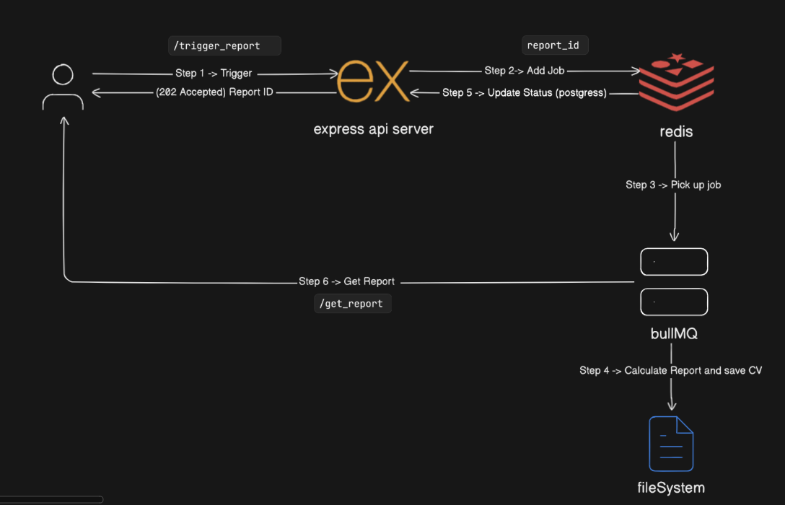

# Store Monitoring Report System

This is a backend service built to solve a real-world problem: monitoring restaurant uptime. The system ingests store status data, compares it against local business hours, and generates on-demand uptime/downtime reports.

The core of the project is an asynchronous data processing pipeline. An API call triggers a report, but the heavy calculation work is handled by a background worker, which is a common pattern for scalable applications.

---

## System Architecture / Flow

The application is split into two main parts: a lightweight API server and a background worker. This ensures that user requests are handled instantly, even if the report generation takes time.

<p align="center">
  
</p>


1.  A **User** hits the `POST /trigger_report` endpoint.
2.  The **API Server** doesn't do any calculations. It just creates a new report entry in the database, adds a job to a Redis queue, and immediately responds with a `report_id`.
3.  A separate **Worker** process, which is always listening to the Redis queue, picks up this new job.
4.  The **Worker** is the powerhouse. It pulls all the necessary data from the database, performs the complex timezone-aware calculations, and saves the final report as a CSV file to the server's filesystem.
5.  As it works, the Worker updates the report's status in the database (from `PENDING` to `RUNNING` to `COMPLETE`).
6.  The **User** can periodically call the `GET /get_report` endpoint with their `report_id` to either get the current status or, once complete, download the final CSV file.

---

## Video Demo

A brief walkthrough of the project setup and a live demonstration of the API in action.

[View the project demo on Loom](https://www.loom.com/share/68eace504a104d0ebdd5f7f24b2ea6e3?sid=ed03ed97-a79a-4819-8a38-04526fb722a5)

---

## Tech Stack

| Category           | Technology                        |
| ------------------ | --------------------------------- |
| **Backend** | Node.js, Express.js, TypeScript   |
| **Database** | PostgreSQL                        |
| **ORM** | Prisma                            |
| **Job Queue** | BullMQ                            |
| **Message Broker** | Redis                             |
| **Containerization**| Docker                            |

---

## Setup and Installation

Follow these steps to get the project running locally.

### Prerequisites

* Node.js (v18 or later)
* pnpm (or npm/yarn)
* Docker and Docker Compose

### 1. Clone & Install Dependencies

Clone the repository and install the packages.

```bash
git clone https://github.com/priyanshu-tiwariii/priyanshuTiwari-27-08-2025
cd priyanshuTiwari-27-08-2025
pnpm install
````

### 2\. Start Services

This command starts the PostgreSQL and Redis containers.

```bash
docker-compose up -d
```

### 3\. Setup Database Schema

This command creates the tables in the database based on the Prisma schema.

```bash
npx prisma migrate dev
```

### 4\. Seed the Database

This script populates the database with the initial data from the CSV files. The CSVs must be in the `/data` directory.

```bash
npm run db:seed
```

-----

## Running the Application

The application requires two separate processes to be running in two different terminals.

**Terminal 1: Start the Worker**
This process listens for and executes jobs.

```bash
node --loader ts-node/esm src/workers/reportWorker.ts
```

**Terminal 2: Start the API Server**
This process handles user requests.

```bash
npm start
```

The API will then be available at `http://localhost:3000`.

-----

## API Usage

### Trigger a Report

Kicks off the report generation process.

  * **Endpoint**: `POST /trigger_report`
  * **Response**: A JSON object with the `report_id`.

**Example `curl` command:**

```bash
curl -X POST http://localhost:3000/trigger_report
```

### Get a Report

Checks the status of a report. If it's complete, the CSV file is returned.

  * **Endpoint**: `GET /get_report`
  * **Query Parameter**: `report_id`
  * **Response**:
      * If pending/running: `{"status": "RUNNING"}`
      * If complete: The CSV file as a download.

**Example `curl` command:**

```bash
# Replace REPORT_ID with the ID from the trigger response
curl "http://localhost:3000/get_report?report_id=REPORT_ID"
```

-----

## Ideas for Improvement

  * **Scalability**: Currently, one worker job handles all stores. For a larger scale, the main job could spawn child jobs for batches of stores. This would allow for parallel processing across multiple worker instances and significantly speed up report generation.
  * **Data Aggregation**: For a system with years of data, querying the raw status logs every time would be inefficient. A better approach would be to run a nightly job that pre-calculates daily uptime/downtime and stores it in an aggregate table. Reports would then be generated from this summary table almost instantly.
  * **Error Handling & Retries**: The BullMQ worker could be configured with a retry strategy. If a job fails due to a temporary issue (like a brief database disconnection), it could automatically retry a few times before marking the report as failed.
  * **Configuration Management**: Hardcoded values like database and Redis connection details should be moved into environment variables (`.env` file). This is standard practice and makes it easy to configure the application for different environments (development, staging, production).

-----

## Sample Output

The system generates reports in CSV format.  
An example file has been added to this repository for demonstration:  
[View sample_report_output.csv](https://github.com/priyanshu-tiwariii/priyanshuTiwari-27-08-2025/blob/main/reports/0e59655c-0fe7-4d8c-b259-750898ed595c.csv)

